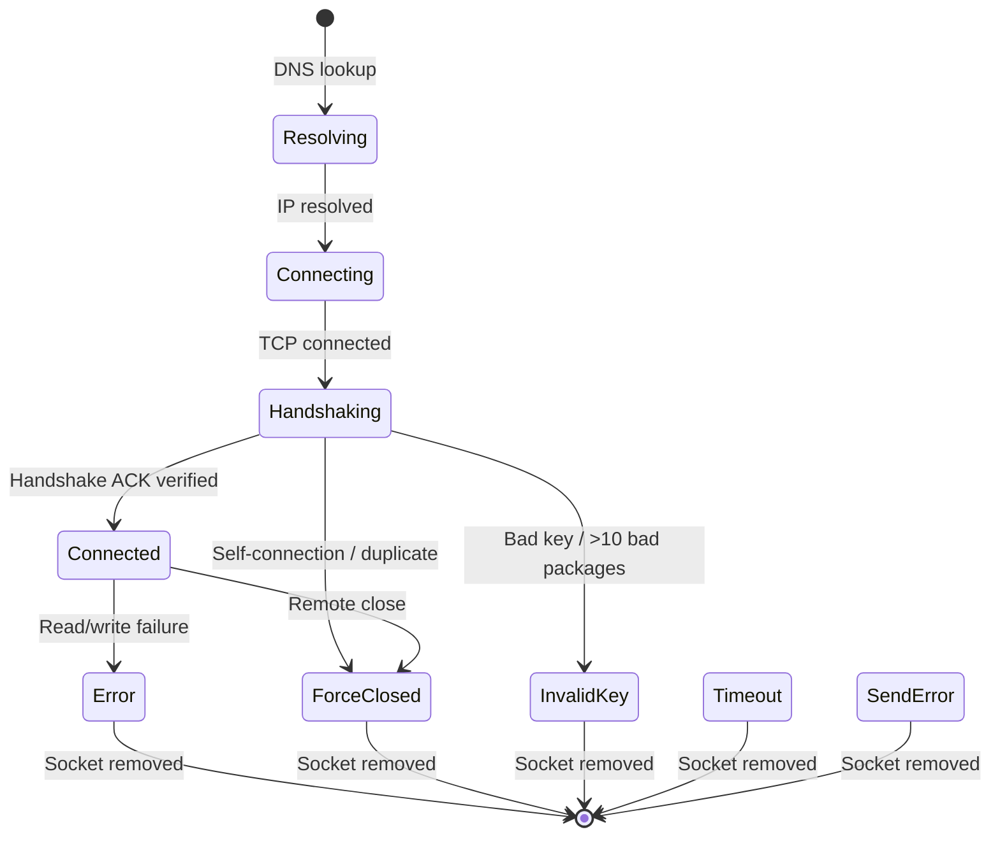

# 01 - Architecture and Format

> Sections 1-4 of the [MWB Protocol Documentation](mwb-protocol.md).

---

## 1. Architecture Overview

Mouse Without Borders is a peer-to-peer KVM (Keyboard, Video, Mouse) sharing system. It allows up to 4 machines to share a single keyboard and mouse with seamless edge-crossing transitions.

```
+----------+     TCP/encrypted      +----------+
| MachineA | <--------------------> | MachineB |
| (Port N) |                        | (Port N) |
+----------+                        +----------+
     ^                                   ^
     | TCP/encrypted                     | TCP/encrypted
     v                                   v
+----------+                        +----------+
| MachineC | <--------------------> | MachineD |
| (Port N) |                        | (Port N) |
+----------+                        +----------+
```

**Key characteristics:**
- All traffic is encrypted with AES-256-CBC
- Two TCP connections per machine pair: Message channel + Clipboard channel
- Up to 4 machines in a matrix
- No central server -- fully peer-to-peer
- Controller machine coordinates switching, but any machine can initiate

---

## 2. Network Topology

### Port Layout

Default base port: `15100` (configurable).

| Channel         | Port         | Purpose                                      |
|-----------------|--------------|----------------------------------------------|
| Clipboard Server| `basePort`   | File/clipboard data transfer (port 15100)    |
| Message Server  | `basePort+1` | Input events, heartbeats, control (port 15101)|

### Socket Architecture

Each machine runs two TCP servers and maintains a socket pool of connections to all other machines in the matrix.

```
Machine A                              Machine B
+------------------------+             +------------------------+
| ClipboardServer :15100 |<---------->| Client sockets :15100  |
| MessageServer  :15101  |<---------->| Client sockets :15101  |
| Client sockets         |             | ClipboardServer :15100 |
|   to B :15100          |             | MessageServer  :15101  |
|   to B :15101          |             +------------------------+
+------------------------+
```

### Socket Status Lifecycle

> Source: [`SocketStuff.cs`](../reference/PowerToys/src/modules/MouseWithoutBorders/App/Class/SocketStuff.cs) `SocketStatus` enum (line 54)



### TcpSk (Socket Wrapper)

> Source: [`SocketStuff.cs`](../reference/PowerToys/src/modules/MouseWithoutBorders/App/Class/SocketStuff.cs) `TcpSk` class (line 68)

Each TCP socket is wrapped in a `TcpSk` object containing:

| Field           | Type          | Description                            |
|-----------------|---------------|----------------------------------------|
| `IsClient`      | bool          | True if this is an outbound connection |
| `BackingSocket` | Socket        | Raw TCP socket                         |
| `Status`        | SocketStatus  | Current lifecycle state                |
| `MachineName`   | string        | Remote machine hostname                |
| `MachineId`     | uint          | Remote machine ID                      |
| `Address`       | IPAddress     | Remote IP address                      |
| `EncryptedStream`| CryptoStream | AES-256-CBC write stream               |
| `DecryptedStream`| CryptoStream | AES-256-CBC read stream                |
| `BirthTime`     | long          | Tick at creation (for timeout)         |

---

## 3. Encryption

> Source: [`Encryption.cs`](../reference/PowerToys/src/modules/MouseWithoutBorders/App/Core/Encryption.cs)

### Cipher Configuration

> Source: [`Encryption.cs`](../reference/PowerToys/src/modules/MouseWithoutBorders/App/Core/Encryption.cs) `InitEncryption()` (line 93)

| Parameter    | Value                                        |
|--------------|----------------------------------------------|
| Algorithm    | AES (AesCryptoServiceProvider)               |
| Key Size     | 256 bits                                     |
| Block Size   | 128 bits (16 bytes)                          |
| Mode         | CBC                                          |
| Padding      | Zeros                                        |

### Key Derivation

> Source: [`Encryption.cs`](../reference/PowerToys/src/modules/MouseWithoutBorders/App/Core/Encryption.cs) `GenLegalKey()` (line 117)

The user provides a plaintext key (shared across all machines). The actual AES key is derived via PBKDF2:

```
salt     = UTF-16LE bytes of InitialIV = "18446744073709551615" (ulong.MaxValue.ToString())
iterations = 50,000
hash     = SHA-512
output   = 32 bytes (256-bit AES key)
```

### Initial IV

> Source: [`Encryption.cs`](../reference/PowerToys/src/modules/MouseWithoutBorders/App/Core/Encryption.cs) line 41

The Initial IV is derived from the string `"18446744073709551615"` (ASCII representation of `ulong.MaxValue`):
- Padded or truncated to exactly 16 bytes (AES block size)

### Random Initial Block

> Source: [`Common.cs`](../reference/PowerToys/src/modules/MouseWithoutBorders/App/Core/Common.cs) `SendOrReceiveARandomDataBlockPerInitialIV()` (line 1528)

When an encrypted stream is first created, 16 bytes of random data are written/read. This ensures the first real block encrypts differently even with the same IV.

```
Sender                          Receiver
  |--- 16 random bytes -------->|
  |<-- 16 random bytes ---------|
  |--- encrypted packages ----->|
  |<-- encrypted packages ------|
```

### Magic Number (24-bit Hash)

> Source: [`Encryption.cs`](../reference/PowerToys/src/modules/MouseWithoutBorders/App/Core/Encryption.cs) `Get24BitHash()` (line 170)

A 24-bit magic number is derived from the user key for package validation:

```
input    = key string padded to 32 bytes
hash     = SHA-512(input)
repeat   = SHA-512(hash) x 50,000 iterations
magic    = (hash[0] << 23) + (hash[1] << 16) + (hash[last] << 8) + hash[2]
           ^ upper 16 bits used in packages (bytes[2..3])
```

---

## 4. Package Format

> Source: [`DATA.cs`](../reference/PowerToys/src/modules/MouseWithoutBorders/App/Core/DATA.cs), [`Package.cs`](../reference/PowerToys/src/modules/MouseWithoutBorders/App/Core/Package.cs), [`PackageType.cs`](../reference/PowerToys/src/modules/MouseWithoutBorders/App/Core/PackageType.cs)

### Standard Package (32 bytes)

> Source: [`Package.cs`](../reference/PowerToys/src/modules/MouseWithoutBorders/App/Core/Package.cs) `PACKAGE_SIZE = 32` (line 17)

All packages are exactly 32 bytes when serialized. The DATA struct uses explicit field offsets (union-like layout):

> Source: [`DATA.cs`](../reference/PowerToys/src/modules/MouseWithoutBorders/App/Core/DATA.cs) field offsets (lines 27-73)

```
Offset  Size  Field           Description
------  ----  -----           -----------
0       4     Type            PackageType (int). Byte[0]=type, [1]=checksum, [2..3]=magic
4       4     Id              Package sequence ID
8       4     Src             Source machine ID
12      4     Des             Destination machine ID (0=None, 255=All)
16      8     DateTime        Timestamp (not always used)
24      8     Payload         Union of: KEYBDDATA / MOUSEDATA / machine slots
```

### Extended Package (64 bytes)

> Source: [`Package.cs`](../reference/PowerToys/src/modules/MouseWithoutBorders/App/Core/Package.cs) `PACKAGE_SIZE_EX = 64` (line 18)

Some package types use 64 bytes. The first 32 bytes are the standard header, followed by 32 additional bytes:

```
Offset  Size  Field           Description
------  ----  -----           -----------
0-31          (same as standard package)
32      32    Extended payload  Machine name (4 x int64) or clipboard data
```

**Big package types** (64-byte): `Hello`, `Awake`, `Heartbeat`, `Heartbeat_ex`, `Handshake`, `HandshakeAck`, `ClipboardPush`, `Clipboard`, `ClipboardAsk`, `ClipboardImage`, `ClipboardText`, `ClipboardDataEnd`, and `Matrix` variants.

> Source: [`DATA.cs`](../reference/PowerToys/src/modules/MouseWithoutBorders/App/Core/DATA.cs) `IsBigPackage` property (line 124)

### Wire Format: Checksum and Magic

> Source: [`SocketStuff.cs`](../reference/PowerToys/src/modules/MouseWithoutBorders/App/Class/SocketStuff.cs) `TcpSendData()` (line 497)

Before sending, bytes `[1..3]` are overwritten:

```csharp
// Write magic number (upper 16 bits of 24-bit hash)
bytes[3] = (byte)((magicNumber >> 24) & 0xFF);
bytes[2] = (byte)((magicNumber >> 16) & 0xFF);

// Compute and write checksum (sum of bytes[2..31])
bytes[1] = 0;
for (int i = 2; i < 32; i++)
    bytes[1] += bytes[i];
```

> Source: [`SocketStuff.cs`](../reference/PowerToys/src/modules/MouseWithoutBorders/App/Class/SocketStuff.cs) `ProcessReceivedDataEx()` (line 531)

On receive, validation occurs:
1. Check magic: `(buf[3] << 24) + (buf[2] << 16) == magicNumber & 0xFFFF0000`
2. Check checksum: `buf[1] == sum(buf[2..31])`
3. On failure, set `buf[0] = PackageType.Invalid`

### DATA Union Layout

> Source: [`DATA.cs`](../reference/PowerToys/src/modules/MouseWithoutBorders/App/Core/DATA.cs) field offsets (lines 27-93)

The payload area (offset 16+) is a union:

```
Offset  KEYBDDATA      MOUSEDATA      MachineSlots   MachineName
------  ----------     ---------      ------------   -----------
16      -              -              Machine1       -
20      -              -              Machine2       -
24      -              -              Machine3       -
28      -              -              Machine4       -
16      wVk (4B)       X (4B)         -              -
20      dwFlags (4B)   Y (4B)         -              -
24      -              WheelDelta(4B) -              -
28      -              dwFlags (4B)   -              -
32+     -              -              -              machineNameP1 (8B)
40+     -              -              -              machineNameP2 (8B)
48+     -              -              -              machineNameP3 (8B)
56+     -              -              -              machineNameP4 (8B)
```

MachineName = 32 ASCII chars across 4 x int64 fields at the extended payload area.

### ID Enum

> Source: [`ID.cs`](../reference/PowerToys/src/modules/MouseWithoutBorders/App/Core/ID.cs) (line 15)

| Value | Name  | Description                     |
|-------|-------|---------------------------------|
| 0     | NONE  | No machine / uninitialized      |
| 255   | ALL   | Broadcast to all machines       |
| 1-254 | (dynamic) | Assigned machine IDs        |

### MOUSEDATA Struct

> Source: [`MOUSEDATA.cs`](../reference/PowerToys/src/modules/MouseWithoutBorders/App/Core/MOUSEDATA.cs) (line 19)

| Field       | Type | Description                              |
|-------------|------|------------------------------------------|
| X           | int  | X coordinate (pixels or universal 0-65535)|
| Y           | int  | Y coordinate                             |
| WheelDelta  | int  | Scroll delta (or next machine ID for NextMachine)|
| dwFlags     | int  | WM_ mouse event type                     |

### KEYBDDATA Struct

> Source: [`KEYBDDATA.cs`](../reference/PowerToys/src/modules/MouseWithoutBorders/App/Core/KEYBDDATA.cs) (line 19)

| Field   | Type | Description              |
|---------|------|--------------------------|
| wVk     | int  | Virtual key code         |
| dwFlags | int  | LLKHF flags (UP, etc.)   |

---

[Back to index](mwb-protocol.md) | Next: [02 - Connection and Handshake](02-connection-and-handshake.md)
